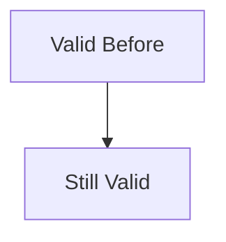
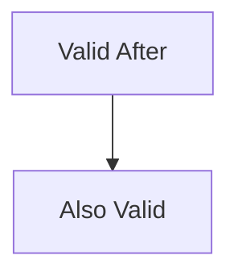

# Invalid Mermaid Fixture

```mermaid
graph TD
  A[Valid Before] --> B[Still Valid]
```

```mermaid
notADiagramType
  this is not mermaid at all
```

```mermaid
graph TD
  C[Valid After] --> D[Also Valid]
```

Text after the diagrams.
