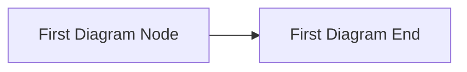
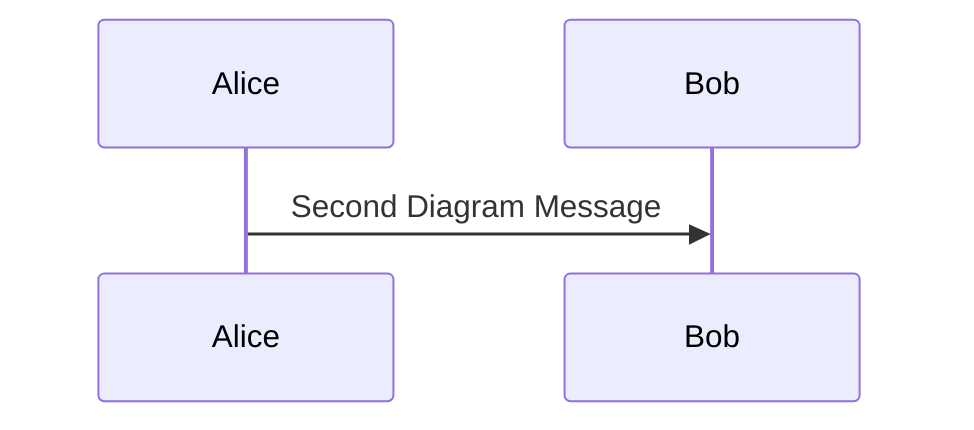

# Multi Mermaid Fixture


```mermaid
graph LR
  A[First Diagram Node] --> B[First Diagram End]
```

A paragraph between the diagrams.

```js
const notADiagram = true;
```


```mermaid
sequenceDiagram
  Alice->>Bob: Second Diagram Message
```
