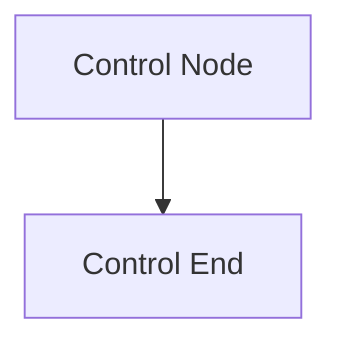
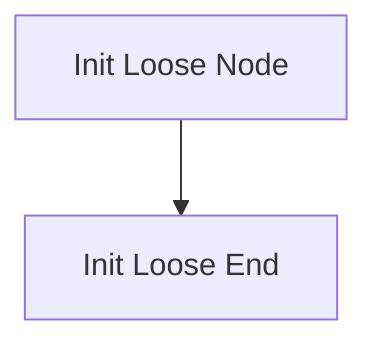
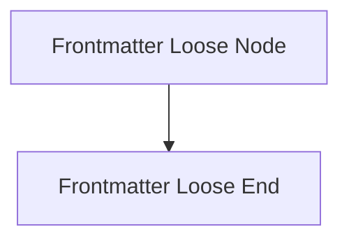
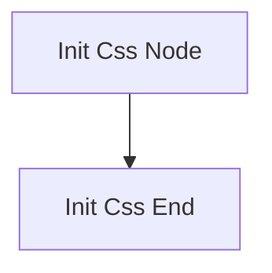
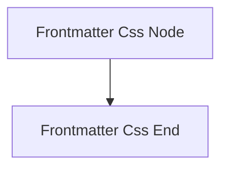
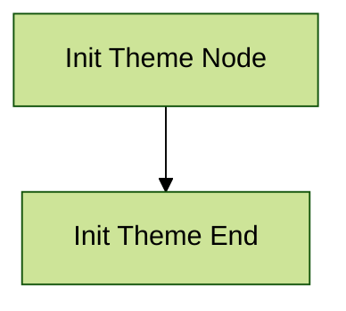
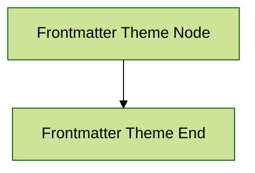
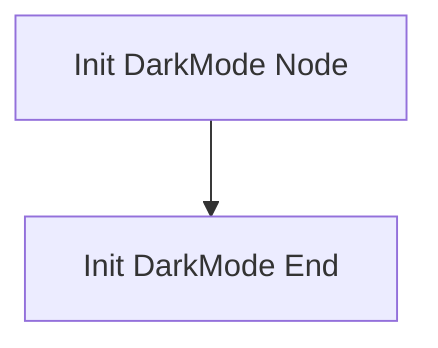
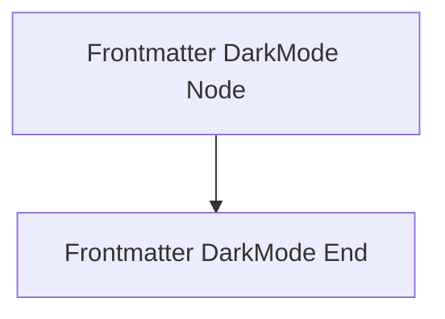

# Override Mermaid Fixture

Each diagram tries to change a locked Mermaid key (#158). Diagram 0 is the
control with no override.

```mermaid
graph TD
  N0[Control Node] --> M0[Control End]
```

```mermaid
%%{init: {"securityLevel": "loose"}}%%
graph TD
  N1[Init Loose Node] --> M1[Init Loose End]
  click N1 mdvCallback "tip"
```

```mermaid
---
config:
  securityLevel: loose
---
graph TD
  N2[Frontmatter Loose Node] --> M2[Frontmatter Loose End]
  click N2 mdvCallback "tip"
```

```mermaid
%%{init: {"themeCSS": ".mdv-attacker { fill: #ff00ff; }", "fontFamily": "AttackerFont", "altFontFamily": "AttackerAltFont", "themeVariables": {"primaryColor": "#ff00ff", "fontFamily": "AttackerVarFont"}}}%%
graph TD
  N3[Init Css Node] --> M3[Init Css End]
```

```mermaid
---
config:
  themeCSS: ".mdv-attacker { fill: #ff00ff; }"
  fontFamily: AttackerFont
  altFontFamily: AttackerAltFont
  themeVariables:
    primaryColor: "#ff00ff"
    fontFamily: AttackerVarFont
---
graph TD
  N4[Frontmatter Css Node] --> M4[Frontmatter Css End]
```

```mermaid
%%{init: {"theme": "forest"}}%%
graph TD
  N5[Init Theme Node] --> M5[Init Theme End]
```

```mermaid
---
config:
  theme: forest
---
graph TD
  N6[Frontmatter Theme Node] --> M6[Frontmatter Theme End]
```

```mermaid
%%{init: {"darkMode": true}}%%
graph TD
  N7[Init DarkMode Node] --> M7[Init DarkMode End]
```

```mermaid
---
config:
  darkMode: true
---
graph TD
  N8[Frontmatter DarkMode Node] --> M8[Frontmatter DarkMode End]
```
