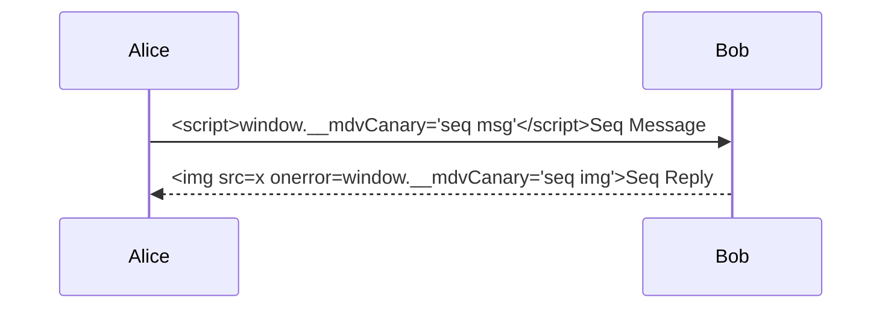
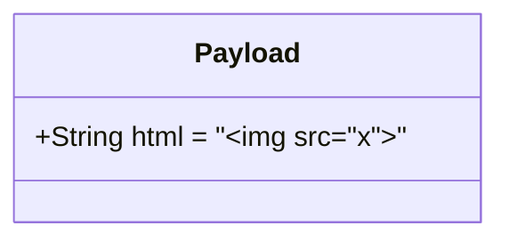

# XSS Mermaid Fixture

Every payload below tries to set `window.__mdvCanary`. None may succeed (#159).

```mermaid
graph TD
  A["<script>window.__mdvCanary = 'script label'</script>Script Label"] --> B["<img src=x onerror=window.__mdvCanary='img label'>Img Label"]
  B -->|"<img src=x onerror=window.__mdvCanary='edge label'>Edge Label"| C["&lt;b&gt;Entity Label&lt;/b&gt; &#60;script&#62;window.__mdvCanary='entity'&#60;/script&#62;"]
  C --> D["<a href='javascript:window.__mdvCanary=1'>Anchor Label</a>"]
  D --> E["<svg onload=window.__mdvCanary='svg onload'></svg>Svg Label"]
  click A "javascript:window.__mdvCanary='click href'" "tip"
  click B href "javascript:window.__mdvCanary='click href 2'"
  click C call mdvCallback()
  click D mdvCallback
```

```mermaid
sequenceDiagram
  participant A as Alice
  participant B as Bob
  A->>B: <script>window.__mdvCanary='seq msg'</script>Seq Message
  B-->>A: <img src=x onerror=window.__mdvCanary='seq img'>Seq Reply
  link A: Evil @ javascript:window.__mdvCanary='seq link'
```

```mermaid
classDiagram
  class Payload {
    +String html = "<img src=x onerror=window.__mdvCanary='class'>"
  }
  click Payload href "javascript:window.__mdvCanary='class click'"
```
