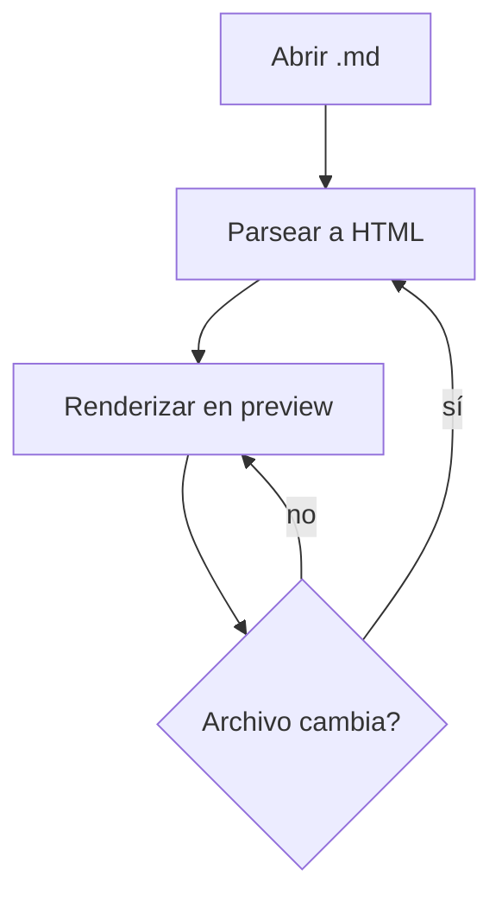
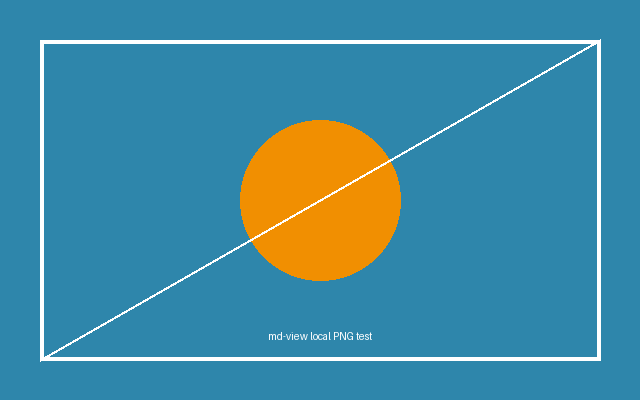
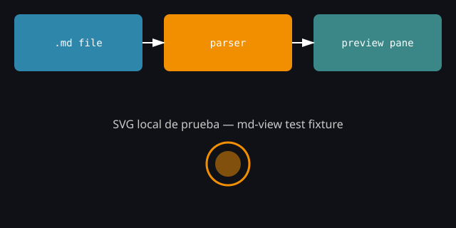

<!-- Este comentario HTML no debería renderizarse como texto visible. Si aparece en pantalla, es un bug. -->

# md-view — Test Fixture

Este archivo es un fixture de prueba, no documentación real. Cubre la mayoría de los
elementos de GFM (GitHub Flavored Markdown) más algunos casos borde y un bloque
dedicado a validar el invariante de seguridad `html: false`. El texto de relleno usa
lorem ipsum — el contenido en sí no importa, importa cómo se renderiza.

> **Cómo usar este archivo:** abrilo con `md-view`, dejalo con live-reload activo, y
> anotá cualquier sección que no se vea como se espera. Cada sección numerada es un
> caso de test independiente.

## Tabla de Contenidos

Los anchors de abajo asumen slugs estilo GitHub (minúsculas, tildes preservadas,
espacios → guiones, puntuación fuera). Si un link no salta a la sección correcta,
**eso es en sí mismo un hallazgo** sobre cómo `md-view` genera los IDs de heading.

1. [Encabezados](#1-encabezados)
2. [Énfasis y formato en línea](#2-énfasis-y-formato-en-línea)
3. [Párrafos y saltos de línea](#3-párrafos-y-saltos-de-línea)
4. [Listas](#4-listas)
5. [Citas (blockquotes)](#5-citas-blockquotes)
6. [Código](#6-código)
7. [Tablas](#7-tablas)
8. [Imágenes](#8-imágenes)
9. [Enlaces](#9-enlaces)
10. [Reglas horizontales](#10-reglas-horizontales)
11. [Caracteres especiales y Unicode](#11-caracteres-especiales-y-unicode)
12. [HTML crudo — test de seguridad](#12-html-crudo--test-de-seguridad)
13. [Notas al pie](#13-notas-al-pie)
14. [Párrafo de estrés combinado](#14-párrafo-de-estrés-combinado)

---

## 1. Encabezados

# H1 — Lorem ipsum dolor
## H2 — Sit amet consectetur
### H3 — Adipiscing elit
#### H4 — Sed do eiusmod
##### H5 — Tempor incididunt
###### H6 — Ut labore et dolore

---

## 2. Énfasis y formato en línea

Texto en *cursiva con asteriscos* y _cursiva con guiones bajos_. Texto en
**negrita con asteriscos** y __negrita con guiones bajos__. Texto en
***negrita y cursiva combinadas***. Texto ~~tachado~~ (GFM strikethrough).
Combinación **negrita con `código en línea` adentro** y *cursiva con ~~tachado~~ adentro*.

Caso borde de CommonMark: mid_word_emphasis no debería activar cursiva (no hay
espacio antes del `_`), pero *this should* sí activarla. También: 5*6*7 no debería
generar énfasis (asteriscos pegados a números sin espacio).

`Código en línea con backticks`, y un caso con backtick literal adentro:
``código con un ` backtick suelto``.

---

## 3. Párrafos y saltos de línea

Este es un párrafo normal con lorem ipsum dolor sit amet, consectetur adipiscing
elit. Sed do eiusmod tempor incididunt ut labore et dolore magna aliqua. Ut enim ad
minim veniam, quis nostrud exercitation ullamco laboris nisi ut aliquip ex ea
commodo consequat.

Esta línea termina con dos espacios al final para forzar un salto de línea duro (hard break).
Esta debería empezar en una línea nueva sin ser un párrafo nuevo.

Esta línea no tiene espacios al final, así que es un salto de línea suave (soft
break) — según CommonMark debería colapsar en un espacio dentro del mismo párrafo.

Línea larga sin cortes para probar el word-wrap del panel de preview: Lorem ipsum dolor sit amet consectetur adipiscing elit sed do eiusmod tempor incididunt ut labore et dolore magna aliqua ut enim ad minim veniam quis nostrud exercitation ullamco laboris nisi ut aliquip ex ea commodo consequat duis aute irure dolor in reprehenderit in voluptate velit esse cillum dolore eu fugiat nulla pariatur.

---

## 4. Listas

### 4.1 No ordenadas

- Item con guion, nivel 1
  - Item con guion, nivel 2
    - Item con guion, nivel 3
* Item con asterisco, nivel 1
  * Item con asterisco, nivel 2
+ Item con signo más, nivel 1
  + Item con signo más, nivel 2

### 4.2 Ordenadas

1. Primer item
2. Segundo item
   1. Sub-item anidado
   2. Otro sub-item
3. Tercer item
7. Item con número fuera de secuencia (debería seguir el orden 4, no saltar a 7)

Lista que empieza en un número distinto de 1:

5. Item que arranca en cinco
6. Siguiente item

### 4.3 Listas de tareas (task list)

- [x] Tarea completada
- [ ] Tarea pendiente
- [x] Tarea completada con **negrita** adentro
- [ ] Tarea pendiente con `código` adentro
  - [ ] Sub-tarea anidada pendiente
  - [x] Sub-tarea anidada completada

### 4.4 Listas "loose" vs "tight"

Tight (sin líneas en blanco entre items):
- Uno
- Dos
- Tres

Loose (con líneas en blanco entre items — cada item debería envolverse en `<p>`):

- Uno

- Dos

- Tres

---

## 5. Citas (blockquotes)

> Cita simple de una línea. Lorem ipsum dolor sit amet.

> Cita de varias líneas que continúa
> en la siguiente línea sin cortarse.
>
> Y este es un segundo párrafo dentro de la misma cita.

> Nivel 1 de cita
> > Nivel 2 de cita, anidada
> > > Nivel 3 de cita, anidada más profundo

> Cita que contiene otros elementos:
> - Item de lista dentro de una cita
> - Otro item
>
> ```js
> // código dentro de una cita
> console.log("hola desde el blockquote");
> ```

---

## 6. Código

### 6.1 Código en línea

Usá `npm install` para instalar dependencias, o `const x = 1;` como ejemplo trivial.

### 6.2 Bloques con lenguaje declarado

```javascript
// JavaScript
function greet(name) {
  const message = `Hola, ${name}!`;
  console.log(message);
  return message.length > 10 ? "largo" : "corto";
}
greet("md-view");
```

```typescript
// TypeScript
interface BridgeApi {
  openFile(path: string): Promise<string>;
  onFileChanged(cb: (content: string) => void): void;
}

const bridge: BridgeApi = {
  openFile: async (path) => "contenido",
  onFileChanged: (cb) => cb("nuevo contenido"),
};
```

```python
# Python
def fibonacci(n: int) -> list[int]:
    seq = [0, 1]
    for _ in range(n - 2):
        seq.append(seq[-1] + seq[-2])
    return seq

print(fibonacci(10))
```

```bash
#!/usr/bin/env bash
set -euo pipefail

echo "Building md-view..."
npm run build && npm test
```

```json
{
  "name": "md-view",
  "version": "0.1.0",
  "private": true,
  "dependencies": {
    "chokidar": "^3.6.0",
    "highlight.js": "^11.9.0"
  }
}
```

```yaml
name: CI
on: [push, pull_request]
jobs:
  test:
    runs-on: ubuntu-latest
    steps:
      - uses: actions/checkout@v4
      - run: npm ci && npm test
```

```css
.preview-pane {
  font-family: "Inter", sans-serif;
  padding: 1rem 2rem;
  background-color: var(--bg-color, #1e1e1e);
}
```

```html
<!-- Este bloque está DENTRO de un code fence: debe mostrarse como texto plano resaltado, no ejecutarse -->
<div class="test">
  <script>alert('esto no debería ejecutarse, es solo texto de ejemplo')</script>
</div>
```

```sql
SELECT id, title, updated_at
FROM documents
WHERE status = 'draft'
ORDER BY updated_at DESC
LIMIT 10;
```

```rust
fn main() {
    let files: Vec<&str> = vec!["a.md", "b.md"];
    for f in files.iter() {
        println!("watching {}", f);
    }
}
```

```jsx
function Preview({ content }) {
  return (
    <div className="preview">
      <ReactMarkdown>{content}</ReactMarkdown>
    </div>
  );
}
```

### 6.3 Bloque sin lenguaje declarado

```
Este bloque no tiene lenguaje asociado.
Debería renderizarse como texto monoespaciado plano, sin syntax highlighting.
    Indentación interna preservada.
```

### 6.4 Bloque con lenguaje inventado / no soportado

```noexiste-lang-123
Este bloque declara un lenguaje que no existe.
El fallback esperado es texto plano sin highlighting (no debería romper el render).
```

### 6.5 Bloque de código indentado (4 espacios, estilo Markdown clásico)

    function oldStyleCodeBlock() {
      return "indentado con 4 espacios, sin fences";
    }

### 6.6 Sintaxis Markdown dentro de un code fence (no debe interpretarse)

```markdown
# Esto no es un heading real, es texto dentro de un code block
**Esto no debería ponerse en negrita**
- Esto no debería ser un item de lista real
[Este link](https://no-deberia-ser-clickeable.example.com) tampoco debería ser clickeable
```

### 6.7 Mermaid (soporte opcional — sirve para ver el fallback)



---

## 7. Tablas

### 7.1 Tabla básica

| Columna A | Columna B | Columna C |
|-----------|-----------|-----------|
| uno       | dos       | tres      |
| cuatro    | cinco     | seis      |

### 7.2 Tabla con alineación

| Izquierda | Centro | Derecha |
|:----------|:------:|--------:|
| a         |   b    |       c |
| lorem     | ipsum  |   dolor |

### 7.3 Tabla con formato en línea dentro de celdas

| Elemento | Estado | Notas |
|---|---|---|
| **negrita** | `código` | *cursiva con ~~tachado~~* |
| [link interno](#7-tablas) | ✅ | normal |

### 7.4 Tabla ancha (test de overflow / scroll horizontal)

| Col 1 | Col 2 | Col 3 | Col 4 | Col 5 | Col 6 | Col 7 | Col 8 | Col 9 | Col 10 |
|---|---|---|---|---|---|---|---|---|---|
| lorem | ipsum | dolor | sit | amet | consectetur | adipiscing | elit | sed | do |
| a | b | c | d | e | f | g | h | i | j |

---

## 8. Imágenes

Imagen local PNG (path relativo, generada como asset de este fixture):



Imagen local SVG (path relativo):



Imagen remota (requiere red — sirve para ver si `md-view` bloquea contenido remoto vía CSP):


Imagen rota a propósito (path que no existe — test de manejo de error / alt text):


Imagen usada como link (patrón `[](url)`):

[](https://github.com/chamix/md-view)

---

## 9. Enlaces

- Link externo estándar: [repo de md-view](https://github.com/chamix/md-view) — debería abrir con `shell.openExternal`, **nunca** navegar la ventana de la app.
- Link externo con título: [repo de blueprints](https://github.com/chamix/claude-blueprints "Sistema de gobernanza")
- Autolink: <https://www.anthropic.com>
- Autolink de email: <no-reply@example.com>
- Link interno / anchor a una sección de este mismo documento: [volver a la Tabla de Contenidos](#tabla-de-contenidos)
- Link de referencia estilo `[texto][ref]`: revisá la [documentación oficial de GFM][gfm-ref] para más detalle.
- Link relativo a un archivo del propio repo (path relativo, no URL): [ver el README](../README.md)

[gfm-ref]: https://github.github.com/gfm/ "GitHub Flavored Markdown Spec"

---

## 10. Reglas horizontales

Con guiones:

---

Con asteriscos:

***

Con guiones bajos:

___

---

## 11. Caracteres especiales y Unicode

Caracteres escapados (no deberían interpretarse como sintaxis): \*no cursiva\*,
\# no es un heading, \[no es un link\](no-url), \`no es código\`.

Acentos y eñes: áéíóú, ñ, ¿preguntas invertidas?, ¡exclamaciones invertidas!

Símbolos: © ® ™ § ¶ † ‡ • … « » “comillas tipográficas” ‘simples’

Emoji: 🚀 ✅ ❌ 📄 🔍 🧪 ⚙️ 🐛

CJK (para probar fuentes/ancho de línea con scripts no latinos):
中文测试文本，用于检查字体渲染。 日本語のテキストです。 한국어 테스트 텍스트입니다.

Símbolos matemáticos: ∑ ∫ √ ∞ ≈ ≠ ≤ ≥ π α β γ

---

## 12. HTML crudo — test de seguridad

Esta sección existe específicamente para validar el invariante `html: false` del
parser: nada de lo que sigue debería renderizarse como HTML vivo. Todo debería
mostrarse como **texto literal escapado** en el preview.

<div style="color: red; font-weight: bold;">
  Si ves este texto en rojo y negrita renderizado como HTML real (no como texto
  plano), el invariante html:false está roto.
</div>

<script>alert('si esto se ejecuta, hay un problema de seguridad grave')</script>


<a href="javascript:alert('xss')">link con javascript: URI</a>

<iframe src="https://example.com"></iframe>

<!-- Comentario HTML: no debería aparecer como texto visible en el preview -->

---

## 13. Notas al pie

Este es un texto con una nota al pie[^1]. Y acá hay otra referencia[^nota-larga].
El soporte de footnotes es una extensión de GFM — no todos los parsers Markdown la
implementan, así que esta sección también sirve para confirmar si `md-view` la
soporta o no.

[^1]: Esta es la nota al pie simple.
[^nota-larga]: Esta es una nota al pie más larga, con **formato en negrita** y
    hasta un segundo párrafo indentado dentro de la misma nota.

---

## 14. Párrafo de estrés combinado

Un párrafo final que mezcla **todo junto**: *cursiva*, ~~tachado~~, `código en
línea`, un [link externo](https://github.com/chamix/md-view), un ✅ emoji, texto
en **_negrita y cursiva con guion bajo_**, una referencia a nota al pie[^1], y una
oración en español con ñ y acentos: "la contribución técnica está en la
implementación, no en la intención". Fin del fixture.
